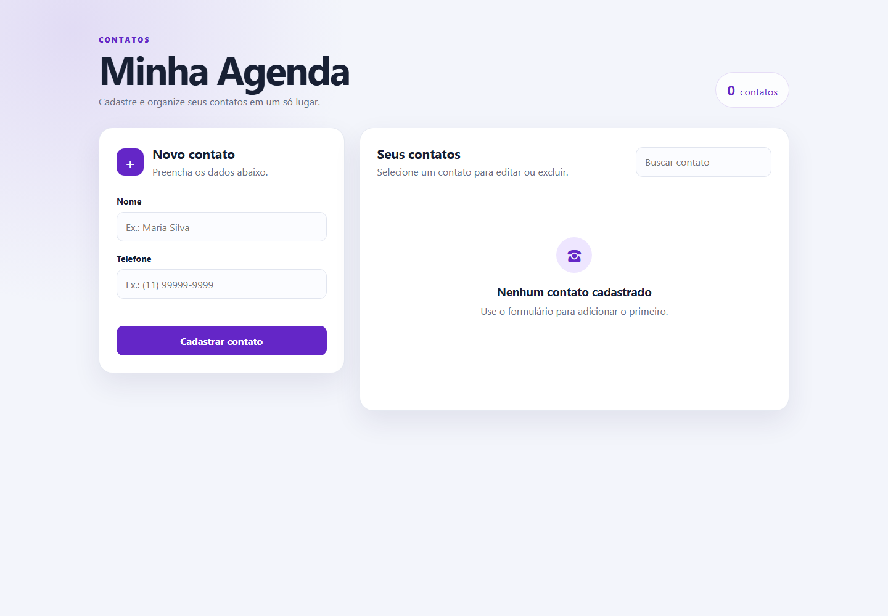

# Phonebook App

Aplicação web moderna para gerenciamento de contatos com interface responsiva, validação robusta e observabilidade integrada.



## Funcionalidades

### Gerenciamento de Contatos
- ✅ **Cadastro** de nome e telefone com validação em tempo real
- 🔍 **Pesquisa instantânea** filtrando por nome ou telefone
- ✏️ **Edição inline** de contatos existentes
- 🗑️ **Exclusão** com confirmação
- 📊 **Contador dinâmico** exibindo total de contatos cadastrados

### Interface e Experiência
- 📱 **Design responsivo** adaptado para desktop, tablet e mobile
- 🎨 **Animações suaves** em todas as interações
- ♿ **Acessibilidade** com ARIA labels e navegação por teclado
- 🌙 **Avatar colorido** gerado automaticamente para cada contato
- 💬 **Sistema de feedback** com modal para sugestões dos usuários
- ⚡ **Estado vazio** explicativo quando não há contatos

### Validação e Segurança
- ✔️ **Validação dupla**: frontend (JavaScript) e backend (Python)
- 📏 **Nome**: 2-80 caracteres, trimming automático de espaços
- 📞 **Telefone**: 8-20 caracteres, aceita números, espaços e símbolos `()+-`
- 📧 **Feedback**: email opcional, mensagem de 10-500 caracteres

### Observabilidade
- 📈 **Datadog APM** para rastreamento distribuído
- 🔍 **Traces detalhados** de requisições HTTP e queries SQL
- 🏷️ **Tags personalizadas**: método, URL, status code, client IP
- ⚕️ **Health check** excluído do tracing para reduzir ruído
- 📊 **Resource naming** padronizado para fácil análise no APM

## Tecnologias

- **Frontend:** HTML5, CSS3 (Grid, Flexbox, Animations), Vanilla JavaScript (ES6+)
- **Backend:** Python 3.12 com `http.server` e threading
- **Banco de dados:** SQLite 3 com row factory
- **Observabilidade:** Datadog APM via `ddtrace`
- **Infraestrutura:** Docker, Docker Compose, Kubernetes

## Arquitetura

A aplicação usa uma arquitetura simples e eficiente com backend Python servindo tanto arquivos estáticos quanto API REST. O tracing APM é injetado via decorator customizado que instrumenta todas as requisições HTTP e queries SQLite.

```text
┌─────────────────────────────────────────────────────────┐
│                      Navegador                          │
│  ┌────────────┐  ┌──────────────┐  ┌───────────────┐  │
│  │   HTML5    │  │  JavaScript  │  │   CSS3/Grid   │  │
│  └────────────┘  └──────────────┘  └───────────────┘  │
└────────────────────┬────────────────────────────────────┘
                     │ HTTP :3001
                     ▼
┌─────────────────────────────────────────────────────────┐
│           Aplicação Python (ThreadingHTTPServer)        │
│  ┌──────────────────────────────────────────────────┐  │
│  │  @traced_request decorator (Datadog APM)         │  │
│  │  ├── Span tags: method, url, status, client_ip  │  │
│  │  └── SQL queries auto-traced via patch()        │  │
│  └──────────────────────────────────────────────────┘  │
│                                                          │
│  ┌───────────────┐  ┌──────────────────────────────┐  │
│  │ Static Files  │  │    API REST                   │  │
│  │ - index.html  │  │ GET    /api/health           │  │
│  │ - app.js      │  │ GET    /api/contacts         │  │
│  │ - styles.css  │  │ POST   /api/contacts         │  │
│  └───────────────┘  │ PUT    /api/contacts/{id}    │  │
│                     │ DELETE /api/contacts/{id}    │  │
│                     │ POST   /api/feedback         │  │
│                     └──────────────────────────────┘  │
└────────────────────┬────────────────────────────────────┘
                     │
                     ▼
┌─────────────────────────────────────────────────────────┐
│              SQLite Database (Volume)                   │
│  ┌──────────────────────────────────────────────────┐  │
│  │  contacts table                                   │  │
│  │  ├── id (INTEGER PRIMARY KEY AUTOINCREMENT)      │  │
│  │  ├── name (TEXT NOT NULL)                        │  │
│  │  ├── phone (TEXT NOT NULL)                       │  │
│  │  └── created_at (TEXT DEFAULT CURRENT_TIMESTAMP) │  │
│  └──────────────────────────────────────────────────┘  │
│  ┌──────────────────────────────────────────────────┐  │
│  │  feedback table                                   │  │
│  │  ├── id (INTEGER PRIMARY KEY AUTOINCREMENT)      │  │
│  │  ├── email (TEXT, nullable)                      │  │
│  │  ├── message (TEXT NOT NULL)                     │  │
│  │  └── created_at (TEXT DEFAULT CURRENT_TIMESTAMP) │  │
│  └──────────────────────────────────────────────────┘  │
└─────────────────────────────────────────────────────────┘
                     │
                     ▼
┌─────────────────────────────────────────────────────────┐
│                   Datadog APM                           │
│  Serviço: phonebookapp                                  │
│  Ambiente: local                                        │
│  Versão: 1.1.1                                          │
└─────────────────────────────────────────────────────────┘
```

### Decisões Arquiteturais

- **Single-threaded HTTP server com threading**: usa `ThreadingHTTPServer` para lidar com múltiplas requisições concorrentes
- **Decorator pattern para tracing**: `@traced_request` injeta spans APM sem poluir a lógica de negócio
- **Health check exclusion**: `/api/health` não gera traces para evitar ruído de probes do Kubernetes
- **Resource naming normalizado**: IDs dinâmicos são substituídos por `{id}` para agrupamento de traces
- **SQLite com row factory**: retorna dicionários em vez de tuplas para fácil serialização JSON

## Pré-requisitos

- Docker Desktop
- Docker Compose

## Executar

Clone o repositório:

```bash
git clone https://github.com/rodrigocflorindo/phonebookapp.git
cd phonebookapp
```

Construa e inicie o container:

```bash
docker compose up -d --build
```

Em instalações que usam o executável clássico:

```bash
docker-compose up -d --build
```

Acesse [http://localhost:3001](http://localhost:3001).

## Parar

```bash
docker compose down
```

Para remover também o banco de dados:

```bash
docker compose down -v
```

## Persistência

O volume `phonebook-data` armazena o arquivo `/data/contacts.db`. Os contatos
permanecem disponíveis após reiniciar ou recriar o container.

## Interface do Usuário

### Layout e Componentes

A interface é dividida em duas colunas principais em desktop e empilhada em mobile:

#### 1. **Hero Section** (Topo da página)
- Título "Minha Agenda" com eyebrow "CONTATOS"
- Subtitle explicativa
- **Contador de contatos** atualizado em tempo real

#### 2. **Card de Formulário** (Coluna esquerda)
- Header com ícone `+` e título dinâmico ("Novo contato" / "Editar contato")
- Campos:
  - **Nome**: input com placeholder, min 2 / max 80 caracteres
  - **Telefone**: input type tel com placeholder, min 8 / max 20 caracteres
- Mensagem de feedback (sucesso/erro)
- Botões:
  - **Cadastrar/Atualizar** (primary button)
  - **Cancelar edição** (secondary, aparece apenas em modo edição)

#### 3. **Card de Lista de Contatos** (Coluna direita)
- **Campo de busca** com filtragem instantânea
- **Estados da lista**:
  - **Loading**: "Carregando contatos..."
  - **Empty state**: ícone de telefone + mensagem quando vazio
  - **Lista de contatos**: cada item contém:
    - Avatar colorido gerado automaticamente
    - Nome em destaque
    - Telefone clicável (link `tel:`)
    - Botões de **Editar** e **Excluir**

#### 4. **Modal de Feedback** (Overlay)
- Botão flutuante `💬 Feedback` no canto inferior direito
- Modal com:
  - Header com título e botão fechar
  - Campo email (opcional)
  - Campo mensagem (textarea, obrigatório)
  - Botões Enviar/Cancelar

### Características Visuais

- **Paleta de cores**: tons de azul (#2563eb primary), cinza neutro, fundos claros
- **Typography**: sistema de fontes nativas (sans-serif stack)
- **Espaçamento**: 8px grid system
- **Animações**:
  - Fade in dos contatos ao carregar
  - Hover effects com elevação em cards
  - Transições suaves de 200ms
  - Scale up em botões ao hover
- **Responsividade**:
  - Desktop (>768px): layout em grid 2 colunas
  - Mobile (<768px): layout empilhado, cards full-width

## API REST

| Método | Endpoint | Descrição | Traced |
| --- | --- | --- | --- |
| `GET` | `/api/health` | Verifica a saúde da aplicação | ❌ |
| `GET` | `/api/contacts` | Lista todos os contatos ordenados por nome | ✅ |
| `POST` | `/api/contacts` | Cria um novo contato | ✅ |
| `PUT` | `/api/contacts/{id}` | Atualiza um contato existente | ✅ |
| `DELETE` | `/api/contacts/{id}` | Exclui um contato | ✅ |
| `POST` | `/api/feedback` | Envia feedback sobre a aplicação | ✅ |

### Validação de Dados

**Contatos (POST/PUT /api/contacts)**:
- `name`: string, 2-80 caracteres, obrigatório
- `phone`: string, 8-20 caracteres, padrão `^[0-9()+\-\s]{8,20}$`, obrigatório

**Feedback (POST /api/feedback)**:
- `email`: string, 0-100 caracteres, opcional, deve conter `@` se preenchido
- `message`: string, 10-500 caracteres, obrigatório

Erros de validação retornam **HTTP 400** com JSON `{"error": "mensagem"}`.

Consulte exemplos de uso em [docs/API.md](docs/API.md).

## Estrutura do Projeto

```text
phonebookapp/
├── app.py                    # Servidor HTTP Python com API REST e tracing APM
├── requirements.txt          # Dependências Python (ddtrace)
├── test_app.py              # Suite de testes unitários
├── Dockerfile               # Build multi-stage otimizado
├── compose.yaml             # Docker Compose com volume persistente
├── CLAUDE.md                # Documentação para Claude Code
├── README.md                # Este arquivo
├── static/                  # Frontend estático
│   ├── index.html          # Interface HTML5 semântica
│   ├── app.js              # Lógica JavaScript (fetch API, DOM manipulation)
│   └── styles.css          # Estilos responsivos com Grid/Flexbox
├── docs/                    # Documentação adicional
│   ├── API.md              # Exemplos de uso da API REST
│   └── phonebook-app.png   # Screenshot da aplicação
└── k8s/                     # Manifests Kubernetes
    └── phonebookapp.yaml   # Namespace, PVC, Deployment, Service
```

### Principais Arquivos

- **app.py** (200+ linhas): servidor HTTP com decorator de tracing, handlers CRUD, validação
- **static/app.js** (200+ linhas): gerenciamento de estado, renderização, busca em tempo real
- **static/styles.css** (250+ linhas): design system completo com variáveis CSS e media queries
- **test_app.py**: 12 testes cobrindo CRUD, validação e persistência

## Testes

A aplicação inclui uma suite de testes unitários cobrindo todos os endpoints da API:

```bash
python3 -m unittest test_app.py -v
```

### Cobertura de Testes

- ✅ **CRUD de Contatos**: criar, listar, atualizar, excluir
- ✅ **Validação**: nome/telefone inválidos, campos faltando
- ✅ **Feedback**: com/sem email, validação de mensagem
- ✅ **Health check**: resposta 200 OK
- ✅ **Persistência**: dados sobrevivem entre requisições

Todos os testes usam um banco SQLite em memória para isolamento.

## Variáveis de Ambiente

| Variável | Descrição | Padrão |
| --- | --- | --- |
| `PORT` | Porta do servidor HTTP | `3000` |
| `DATABASE_PATH` | Caminho do arquivo SQLite | `data/contacts.db` |
| `DD_AGENT_HOST` | Hostname do Datadog Agent | `localhost` |
| `DD_ENV` | Environment tag (APM) | `local` |
| `DD_SERVICE` | Nome do serviço (APM) | `phonebookapp` |
| `DD_VERSION` | Versão do serviço (APM) | `1.1.1` |
| `DD_LOGS_INJECTION` | Injetar trace IDs em logs | `true` |
| `DD_TRACE_SAMPLE_RATE` | Taxa de amostragem (0.0-1.0) | `1.0` |

No Docker Compose, `DD_AGENT_HOST=host.docker.internal` permite que o container envie traces para o Agent rodando no host.

## Executar no Kubernetes do GIRUS

O manifesto cria um namespace próprio, um Deployment, um Service e um volume
persistente de 1 GiB para o SQLite.

Confirme que o contexto ativo é o cluster GIRUS:

```bash
kubectl config use-context kind-girus
```

Construa a imagem e carregue-a no nó do Kind:

```bash
docker build -t phonebookapp:1.0.0 .
kind load docker-image phonebookapp:1.0.0 --name girus
```

Aplique todos os recursos:

```bash
kubectl apply -f k8s/phonebookapp.yaml
kubectl rollout status deployment/phonebookapp -n phonebook-app
```

Publique o serviço localmente:

```bash
kubectl port-forward -n phonebook-app service/phonebookapp 3001:3000
```

Acesse [http://localhost:3001](http://localhost:3001).

## Observabilidade com Datadog APM

### Configuração de Traces

O backend automaticamente envia traces distribuídos para o Datadog APM usando a biblioteca `ddtrace`. A instrumentação é feita via:

1. **Patch automático do SQLite**: `patch(sqlite3=True)` no início do app.py
2. **Decorator customizado**: `@traced_request` injeta spans em cada requisição HTTP

### Tags e Metadata

Cada trace contém as seguintes tags:

| Tag | Exemplo | Descrição |
| --- | --- | --- |
| `service` | `phonebookapp` | Nome do serviço |
| `env` | `local` | Ambiente (local/dev/prod) |
| `version` | `1.1.1` | Versão da aplicação |
| `http.method` | `POST` | Método HTTP |
| `http.url` | `/api/contacts` | Path da requisição |
| `http.status_code` | `201` | Status code da resposta |
| `http.client_ip` | `172.17.0.1` | IP do cliente |
| `resource` | `POST /api/contacts` | Nome do recurso (agrupado) |

### Resource Naming

Os IDs dinâmicos são normalizados para facilitar agrupamento:
- `GET /api/contacts/123` → `GET /api/contacts/{id}`
- `PUT /api/contacts/456` → `PUT /api/contacts/{id}`
- `DELETE /api/contacts/789` → `DELETE /api/contacts/{id}`

**Nota**: `/api/health` **não é rastreado** para evitar ruído das health probes do Kubernetes.

### Visualizar Traces no Datadog

Após gerar tráfego na aplicação, acesse **APM > Traces** no Datadog e filtre:

```text
service:phonebookapp env:local
```

Você verá:
- **Flame graphs** mostrando hierarquia de spans
- **Latência** de cada operação (HTTP request + SQL queries)
- **Throughput** e taxa de erro por endpoint
- **Dependências** entre serviços (service map)

### Verificar Recepção de Traces

**No Kubernetes**:
```bash
kubectl exec -n default daemonset/datadog-agent -c agent -- agent status
```

Verifique a seção `APM Agent` → contador `Traces` deve ser > 0.

**No Docker Compose**:
O container envia traces para `host.docker.internal:8126`. Verifique se o Datadog Agent está rodando no host e ouvindo na porta 8126.

Verifique os recursos:

```bash
kubectl get all,pvc -n phonebook-app
```

Remova a aplicação e o banco:

```bash
kubectl delete -f k8s/phonebookapp.yaml
```

> O Deployment usa uma única réplica porque o SQLite armazena os dados em um
> único arquivo. Para escalar horizontalmente, substitua o SQLite por um banco
> como PostgreSQL.

## Limitações e Considerações

### SQLite em Produção

- ⚠️ **Réplica única apenas**: o Deployment Kubernetes usa `replicas: 1` porque o SQLite armazena dados em um arquivo local que não pode ser compartilhado entre múltiplos pods
- ⚠️ **Strategy Recreate**: evita que múltiplas réplicas acessem o banco simultaneamente durante atualizações
- 💡 **Para escalar horizontalmente**: migre para PostgreSQL, MySQL ou outro SGBD que suporte múltiplos clientes concorrentes

### Feedback Storage

O endpoint `/api/feedback` apenas **armazena** o feedback no banco de dados. Não envia emails nem notificações. Para uso em produção:
- Integre com serviço de email (SendGrid, Mailgun, SES)
- Envie para sistema de tickets (Jira, Linear, GitHub Issues)
- Notifique via Slack/Discord webhooks

### Migrações de Schema

Não há framework de migrações implementado. Mudanças no schema do banco requerem:
- Execução manual de SQL ALTER TABLE
- Ou drop/recreate do volume (perde dados)

Para produção, considere usar **Alembic** ou **SQLAlchemy migrations**.

## Roadmap

Melhorias futuras planejadas:

- [ ] Suporte a PostgreSQL para escalabilidade horizontal
- [ ] Autenticação e multi-tenancy (usuários isolados)
- [ ] Importação/exportação de contatos (CSV, vCard)
- [ ] Favoritar contatos e categorias/tags
- [ ] Dark mode toggle
- [ ] PWA (Progressive Web App) com offline support
- [ ] Internacionalização (i18n) para múltiplos idiomas
- [ ] Notificações push para lembretes de aniversário
- [ ] Integração com serviços de notificação para feedback

## Licença

Distribuído sob a licença MIT. Consulte [LICENSE](LICENSE).

---

**Desenvolvido com ❤️ usando Python, Vanilla JS e Datadog APM**
